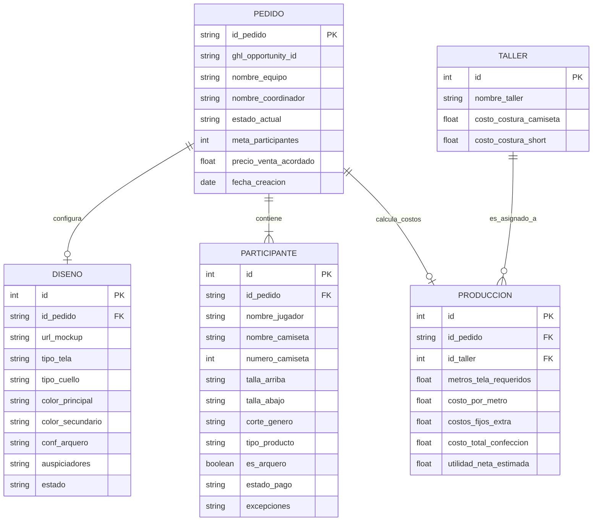

# Diagrama de Base de Datos (Módulo de Pedidos SIPES)

Este es el Diagrama Entidad-Relación (E-R) basado en la lógica de negocio que construimos para el MVP.

### Explicación de las Relaciones Cardinales:
1. **PEDIDO a PARTICIPANTE (1 a Muchos):** Un pedido tiene muchos jugadores.
2. **PEDIDO a DISEÑO (1 a 1):** Un pedido tiene una única configuración gráfica y mockup aprobado.
3. **PEDIDO a PRODUCCIÓN (1 a 1):** Cada pedido tiene una única hoja de costos y rentabilidad.
4. **TALLER a PRODUCCIÓN (1 a Muchos):** Un Taller puede ser asignado a fabricar múltiples pedidos distintos.
