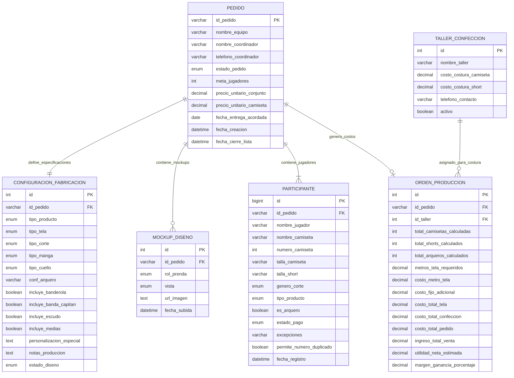

# Diagrama de Base de Datos y Modelo Relacional (SIPES - Módulo de Pedidos)

Este documento describe la arquitectura de datos real de **SIPES (Sistema de Pedidos Sublitex)**. Modela con precisión las entidades, relaciones, restricciones de integridad y cálculos derivados implementados en el sistema operativo.

---

## 1. Diagrama Entidad-Relación (Mermaid ERD)

---

## 2. Diccionario Detallado de Tablas y Atributos

### 2.1. Tabla: `PEDIDO` (Cabecera Principal)
Es el contenedor maestro del pedido. Toda la información operativa gira en torno al `id_pedido`.

| Campo | Tipo de Dato | Nulo | Descripción y Valores Reales |
| :--- | :--- | :--- | :--- |
| `id_pedido` | `VARCHAR(20)` | **NO (PK)** | Código único del pedido (ej. `'SUB-00842'`). |
| `nombre_equipo` | `VARCHAR(100)` | **NO** | Nombre del club o equipo deportivo (ej. `'Los Galácticos FC'`). |
| `nombre_coordinador`| `VARCHAR(100)` | **NO** | Persona encargada de la coordinación y enlace con Sublitex. |
| `telefono_coordinador`| `VARCHAR(20)` | SÍ | Número de contacto de WhatsApp del coordinador. |
| `estado_pedido` | `ENUM` | **NO** | `'registro_abierto'`, `'lista_cerrada'`, `'diseno_aprobado'`, `'en_produccion'`, `'entregado'`. |
| `meta_jugadores` | `INT` | **NO** | Cantidad de jugadores meta acordada con el cliente (ej. `20`). |
| `precio_unitario_conjunto`| `DECIMAL(10,2)`| SÍ | Precio cobrado por cada conjunto completo (ej. `50.00`). |
| `precio_unitario_camiseta`| `DECIMAL(10,2)`| SÍ | Precio cobrado por solo camiseta (ej. `35.00`). |
| `fecha_entrega_acordada` | `DATE` | SÍ | Fecha pactada de entrega de uniformes (ej. `'2026-10-15'`). |
| `fecha_creacion` | `DATETIME` | **NO** | Momento de apertura del pedido. |
| `fecha_cierre_lista` | `DATETIME` | SÍ | Timestamp cuando el coordinador presiona "Cerrar Lista". |

---

### 2.2. Tabla: `CONFIGURACION_FABRICACION` (Ficha Técnica y Gráfica)
Define los estándares técnicos de corte, telas y personalizaciones que el taller y diseño deben respetar.

| Campo | Tipo de Dato | Nulo | Descripción y Valores Reales |
| :--- | :--- | :--- | :--- |
| `id` | `INT` | **NO (PK)** | Identificador autoincremental. |
| `id_pedido` | `VARCHAR(20)` | **NO (FK)** | Referencia a `PEDIDO.id_pedido`. |
| `tipo_producto` | `ENUM` | **NO** | `'conjunto'`, `'camiseta'`, `'mixto'`. |
| `tipo_tela` | `ENUM` | **NO** | `'winfresh'` (Win Fresh), `'microfibra'`, `'algodon'`. |
| `tipo_corte` | `ENUM` | **NO** | `'estandar_varon'`, `'estandar_mujer'`, `'infantil'`, `'unisex'`. |
| `tipo_manga` | `ENUM` | **NO** | `'corta'`, `'larga'`, `'tres_cuartos'`. |
| `tipo_cuello` | `ENUM` | **NO** | `'v'`, `'redondo'`, `'camisero'`, `'neru'`. |
| `conf_arquero` | `VARCHAR(255)` | SÍ | Instrucciones del uniforme del arquero (ej. `'Amarillo Fluorescente / Mismo diseño'`). |
| `incluye_banderola`| `BOOLEAN` | **NO** | `TRUE` si incluye banderola para el capitán. |
| `incluye_banda_capitan`| `BOOLEAN` | **NO** | `TRUE` si incluye cinta elástica de capitán. |
| `incluye_escudo` | `BOOLEAN` | **NO** | `TRUE` si incluye escudo bordado / sublimado / transfer. |
| `incluye_medias` | `BOOLEAN` | **NO** | `TRUE` si el pedido incluye juego de medias. |
| `personalizacion_especial`| `TEXT` | SÍ | Nombres o textos adicionales estándar. |
| `notas_produccion`| `TEXT` | SÍ | Observaciones técnicas para el taller de confección. |
| `estado_diseno` | `ENUM` | **NO** | `'en_revision'` o `'aprobado'`. |

---

### 2.3. Tabla: `MOCKUP_DISENO` (Archivos Visuales Aprobados)
Guarda los bocetos digitales aprobados por el cliente para el estampado y producción.

| Campo | Tipo de Dato | Nulo | Descripción |
| :--- | :--- | :--- | :--- |
| `id` | `INT` | **NO (PK)** | Identificador autoincremental. |
| `id_pedido` | `VARCHAR(20)` | **NO (FK)** | Referencia a `PEDIDO.id_pedido`. |
| `rol_prenda` | `ENUM` | **NO** | `'jugador'` (Jugadores de campo) o `'arquero'` (Porteros). |
| `vista` | `ENUM` | **NO** | `'delantera'` (Frente) o `'espalda'` (Dorsal). |
| `url_imagen` | `TEXT` | **NO** | DataURI / URL de la imagen del mockup cargado. |
| `fecha_subida` | `DATETIME` | **NO** | Timestamp de carga del arte digital. |

---

### 2.4. Tabla: `PARTICIPANTE` (Nómina de Jugadores / Fuente de Verdad)
Cada registro corresponde a una prenda/uniforme individual dentro del pedido.

| Campo | Tipo de Dato | Nulo | Regla de Negocio / Restricción |
| :--- | :--- | :--- | :--- |
| `id` | `BIGINT` | **NO (PK)** | Identificador numérico único de registro. |
| `id_pedido` | `VARCHAR(20)` | **NO (FK)** | Referencia a `PEDIDO.id_pedido`. |
| `nombre_jugador` | `VARCHAR(100)` | SÍ | Nombre real del participante (ej. `'Juan Pérez'`). |
| `nombre_camiseta`| `VARCHAR(30)` | **NO** | Nombre que se estampará en la espalda (en mayúsculas, ej. `'JUAN P.'`). |
| `numero_camiseta` | `INT` | **NO** | **Unicidad:** No puede repetirse en el mismo `id_pedido` salvo autorización explícita. |
| `talla_camiseta` | `VARCHAR(10)` | **NO** | Talla superior: `'10'`, `'14'`, `'S'`, `'M'`, `'L'`, `'XL'`. |
| `talla_short` | `VARCHAR(10)` | SÍ | Talla de pantalón corto independiente (solo si `tipo_producto == 'conjunto'`). |
| `genero_corte` | `ENUM` | **NO** | `'Hombre'`, `'Mujer'`, `'Niño'`. Relevante para curvas de patronaje. |
| `tipo_producto` | `ENUM` | **NO** | `'conjunto'` (Camiseta + Short) o `'camiseta'` (Solo Camiseta). |
| `es_arquero` | `BOOLEAN` | **NO** | `TRUE` si es portero (aplica mockup especial y separación en CSV). |
| `estado_pago` | `ENUM` | **NO** | `'Pendiente'`, `'Abonado'` (50%), `'Pagado'` (100%). |
| `excepciones` | `VARCHAR(255)` | SÍ | Excepciones específicas (ej. `'Manga Larga'`, `'Cuello Redondo'`). |
| `permite_numero_duplicado`| `BOOLEAN` | **NO** | `TRUE` si el administrador autorizó la colisión de número. |
| `fecha_registro` | `DATETIME` | **NO** | Timestamp de creación del registro. |

---

### 2.5. Tabla: `ORDEN_PRODUCCION` (Costos y Rentabilidad)
Genera la liquidación financiera y el desglose de insumos a partir de la nómina real de participantes.

| Campo | Tipo de Dato | Nulo | Fórmula de Cálculo / Derivación |
| :--- | :--- | :--- | :--- |
| `id` | `INT` | **NO (PK)** | Identificador autoincremental. |
| `id_pedido` | `VARCHAR(20)` | **NO (FK)** | Referencia 1 a 1 con `PEDIDO.id_pedido`. |
| `id_taller` | `INT` | **NO (FK)** | Referencia a `TALLER_CONFECCION.id`. |
| `total_camisetas_calculadas`| `INT` | **NO** | `COUNT(PARTICIPANTE)` |
| `total_shorts_calculados` | `INT` | **NO** | `COUNT(PARTICIPANTE WHERE tipo_producto = 'conjunto')` |
| `total_arqueros_calculados`| `INT` | **NO** | `COUNT(PARTICIPANTE WHERE es_arquero = TRUE)` |
| `metros_tela_requeridos` | `DECIMAL(10,2)`| **NO** | Metros de tela requeridos según tizado. |
| `costo_metro_tela` | `DECIMAL(10,2)`| **NO** | Costo por metro de tela adquirido. |
| `costo_fijo_adicional` | `DECIMAL(10,2)`| **NO** | Gastos adicionales de movilidad, hilos, empaque. |
| `costo_total_tela` | `DECIMAL(10,2)`| **NO** | `metros_tela_requeridos * costo_metro_tela` |
| `costo_total_confeccion` | `DECIMAL(10,2)`| **NO** | `(camisetas * costo_cam) + (shorts * costo_sho)` |
| `costo_total_pedido` | `DECIMAL(10,2)`| **NO** | `costo_total_tela + costo_total_confeccion + costo_fijo_adicional` |
| `ingreso_total_venta` | `DECIMAL(10,2)`| **NO** | `(conjuntos * precio_conjunto) + (camisetas * precio_camiseta)` |
| `utilidad_neta_estimada` | `DECIMAL(10,2)`| **NO** | `ingreso_total_venta - costo_total_pedido` |
| `margen_ganancia_porcentaje`| `DECIMAL(5,2)`| **NO** | `(utilidad_neta_estimada / ingreso_total_venta) * 100` |

---

### 2.6. Tabla: `TALLER_CONFECCION` (Proveedores de Costura)
Catálogo de talleres maquiladores externos con sus costos por tipo de prenda.

| Campo | Tipo de Dato | Nulo | Ejemplo |
| :--- | :--- | :--- | :--- |
| `id` | `INT` | **NO (PK)** | `1` |
| `nombre_taller` | `VARCHAR(100)` | **NO** | `'Taller Don Pepe'` / `'Taller Premium'` |
| `costo_costura_camiseta`| `DECIMAL(10,2)`| **NO** | `S/ 4.00` |
| `costo_costura_short` | `DECIMAL(10,2)`| **NO** | `S/ 3.00` |
| `telefono_contacto` | `VARCHAR(20)` | SÍ | `'+51 987 654 321'` |
| `activo` | `BOOLEAN` | **NO** | `TRUE` |

---

## 3. Reglas de Integridad y Lógica de Negocio

1. **Sin Inserción Manual de Totales:**  
   Los campos `total_camisetas_calculadas`, `total_shorts_calculados`, `total_arqueros_calculados` y la **Curva de Tallas** nunca se digitan a mano; se derivan automáticamente mediante agregación de las filas de la tabla `PARTICIPANTE`.
2. **Restricción de Unicidad de Número:**  
   `UNIQUE(id_pedido, numero_camiseta)` a nivel de base de datos, omitible únicamente si `permite_numero_duplicado = TRUE`.
3. **Independencia de Talla de Short:**  
   Si `tipo_producto == 'conjunto'`, el campo `talla_short` puede registrar una talla distinta a `talla_camiseta` sin duplicar filas.
4. **Cálculos Financieros Dinámicos:**
   - **Total Cobrado:** Suma del 100% de registros `'Pagado'` + 50% de registros `'Abonado'`.
   - **Saldo por Cobrar:** `Ingreso Total Estimado - Total Cobrado`.
5. **Aislamiento Total de GoHighLevel / CRMs externos:**  
   El modelo de datos no contiene llaves foráneas ni campos de GoHighLevel, operando de forma 100% autónoma para el flujo de producción textil.

